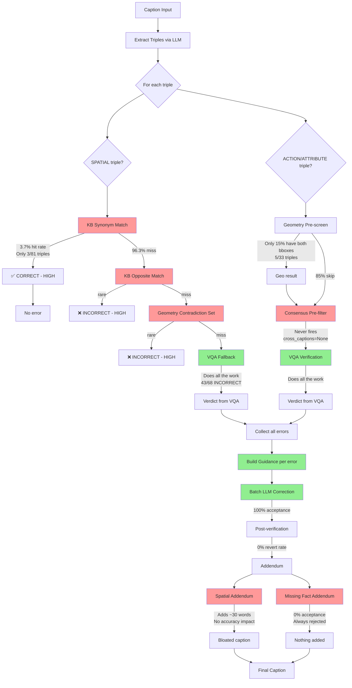
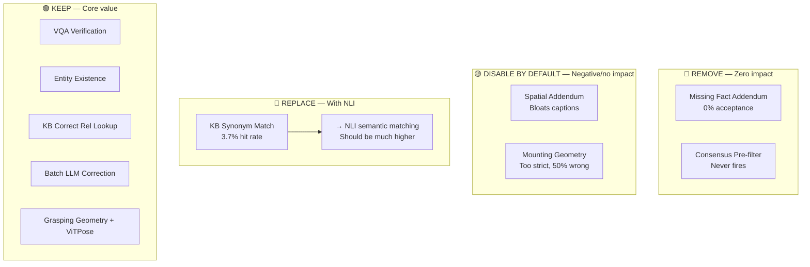
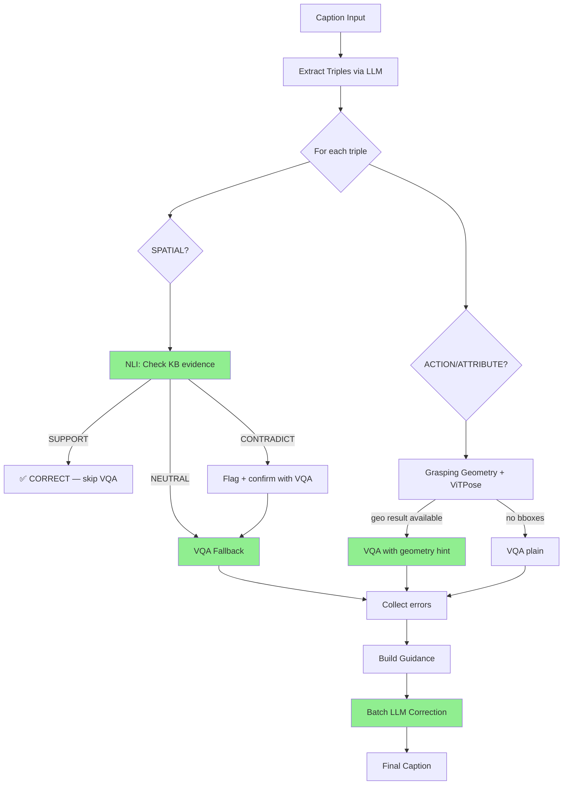

# RelCheck Architecture Analysis — What Works, What Doesn't

## Current Pipeline Flow

**Legend:** 🟢 Green = pulling its weight, 🔴 Red = low/no impact

---

## Component Scorecard

### 🟢 HIGH IMPACT — Keep and improve

| Component | What it does | Evidence | Impact |
|---|---|---|---|
| **VQA Verification** | Asks VLM yes/no about each triple | 43/68 INCORRECT verdicts come from VQA | Core of the system |
| **Entity Existence Check** | GDino can't find entity → VQA confirms absence | 8/68 INCORRECT verdicts | Catches hallucinated objects |
| **KB Correct Relation Lookup** | Finds the RIGHT relation from KB spatial facts | 24/68 corrections use spatial_kb | Free, no API cost |
| **Batch LLM Correction** | Rewrites caption to fix errors | 100% acceptance rate | Actually fixes the text |
| **Triple Extraction** | Parses caption into (S, R, O) triples | 7.4 triples/image average | Foundation of everything |

### 🟡 MEDIUM IMPACT — Keep but needs improvement

| Component | What it does | Evidence | Issue |
|---|---|---|---|
| **Grasping Geometry** | Checks wrist keypoints near object | 3 correct decisions out of 4 | Only fires when GDino finds both bboxes (15%) |
| **Geometry-Grounded VQA Prompts** | Tells VQA what geometry found | +3.1% supplemental improvement | May cause false positives |
| **ViTPose Keypoints** | Gets body pose for action verification | 4 loads, 3/4 agreed with VQA | Limited by bbox coverage |

### 🔴 LOW/NO IMPACT — Candidates for removal

| Component | What it does | Evidence | Why it's dead weight |
|---|---|---|---|
| **Missing Fact Addendum** | LLM adds facts from visual description | 0% acceptance across ALL runs | Every attempt rejected by quality guards |
| **Spatial Addendum** | Appends KB spatial facts to caption | +30 words, 0% accuracy impact | Bloats captions, no benefit |
| **KB Synonym Match** | Word-level match of spatial relations | 3.7% hit rate (3/81 triples) | Too rigid, almost never matches |
| **Mounting Geometry** | Checks if subject is above object | 2 hits, 1 wrong | Too strict for real "sitting on" |
| **Consensus Pre-filter** | Cross-captioner agreement check | 0 fires (never used) | cross_captions always None |
| **Post-verification Revert** | Checks if correction introduced errors | 0% revert rate | Never triggers |

---

## What to prune

---

## Simplified Pipeline (after pruning)

**What changed:**
- NLI replaces the rigid KB synonym/opposite matching
- Addendum removed entirely (both spatial and missing fact)
- Consensus pre-filter removed (unused)
- Mounting geometry removed (unreliable)
- Post-verification kept but simplified (it's cheap, just in case)

---

## Expected Impact of Pruning

| Metric | Before | After (expected) |
|---|---|---|
| KB hit rate | 3.7% | 20-40% (NLI semantic matching) |
| VQA calls per image | ~10 | ~6-7 (NLI skips some) |
| Caption word bloat | +30 words | +0 words (no addendum) |
| Wasted LLM calls | ~2/image (addendum) | 0 |
| Code complexity | 10 modules | 8 modules |
| Pipeline latency | ~30s/image | ~25s/image |

---

## Plain English Summary

Think of the pipeline like a factory assembly line:

1. **Triple Extraction** = the inspector who reads the caption and lists every claim ("man holding cup", "dog on couch")

2. **KB Synonym Match** = a dictionary lookup. "Does our dictionary say 'on' means the same as 'on top of'?" Almost never works because language is too varied. **Replace with NLI.**

3. **Geometry Check** = a ruler measurement. "Are the man's hands near the cup?" Only works when we can find both objects with GDino (half the time). **Keep grasping, remove mounting.**

4. **VQA** = showing the image to another AI and asking "Is this true?" This is the workhorse — does 63% of all error detection. **Keep, it's essential.**

5. **Entity Existence** = "Does this object even exist in the image?" Catches hallucinated objects like "snake" when there's no snake. **Keep.**

6. **Batch Correction** = the editor who rewrites the caption to fix errors. Works perfectly (100% acceptance). **Keep.**

7. **Addendum** = a fact-appender that adds extra info to captions. Spatial addendum bloats without helping. Missing fact addendum is rejected every single time. **Remove both.**

8. **Consensus** = checking if other captioners agree. Never used because we only run one captioner. **Remove.**
