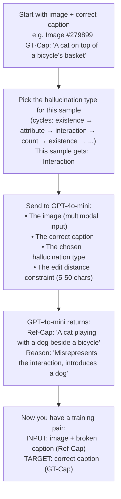

# How Kim et al. Generate Synthetic Hallucinated Captions

This document focuses on ONE thing: how they take a correct caption and turn it into a caption that contains a hallucination.

---

## The Setup

You have:
- An **image** (from COCO or Flickr30K)
- A **correct caption** for that image (called "GT-Cap" — ground-truth caption)

You want to produce:
- A **broken caption** (called "Ref-Cap" — reference caption) that looks almost identical to the correct one, but has exactly ONE thing wrong with it

---

## Who Does the Work

**GPT-4o-mini** generates the hallucinated captions. It receives the image AND the correct caption, and is told to break the caption in a specific way.

---

## The Four Ways They Break a Caption

They define exactly four types of hallucination to inject. One is chosen per sample (cycled sequentially through the dataset — so sample 1 gets type 1, sample 2 gets type 2, sample 3 gets type 3, sample 4 gets type 4, sample 5 gets type 1 again, etc.).

### Type 1: Object Existence

Swap a real object for a fake one.

```
CORRECT:  "A woman walking her dog in the park"
BROKEN:   "A woman walking her cat in the park"
                                 ^^^
                          dog → cat (cat is not in the image)
```

The fake object must be plausible (a cat in a park makes sense) but clearly not what's in the image.

### Type 2: Attribute

Change a property of an object — its color, pose, position, or activity.

```
CORRECT:  "A red car parked on the street"
BROKEN:   "A blue car parked on the street"
            ^^^
            red → blue (the car is actually red)
```

### Type 3: Interaction

Change how objects relate to each other.

```
CORRECT:  "A man is riding a horse in the street"
BROKEN:   "A man is standing next to a horse in the street"
                    ^^^^^^^^^^^^^^^
                    riding → standing next to (wrong relationship)
```

### Type 4: Count

Change how many of something there are.

```
CORRECT:  "Two people standing near a cart"
BROKEN:   "Three people standing near a cart"
            ^^^^^
            Two → Three (there are actually two)
```

---

## The Constraint: Edit Distance

The broken caption must be **close** to the original:

- Edit distance **> 5 characters** (the change must be real, not just a typo)
- Edit distance **< 50 characters** (the change must be small, not a rewrite)

This is what makes it "context-aware" — the hallucination is a **surgical injection**, not a new sentence. Most of the caption stays identical.

---

## The Exact Prompt They Send to GPT-4o-mini

### System Message (sent once, sets the rules):

```
You are a multimodal assistant tasked with modifying captions. 
Specifically, given an image and its corresponding caption, you 
are asked to modify the caption with the following guideline. 
The modified caption must include one aspect that is not 
consistent with the given image. The aspects are as follows:

Object existence: Modify the caption by replacing an existing 
objects with a non-existent one, ensuring that the changes are 
clearly different from the image but remain plausible.

Attribute: Misdescribe the attribute such as color, pose, 
position, and activity of one of the objects in the caption.

Interaction: Modify the caption to mispresent the interactions 
among the objects in the image.

Count: Change the caption to inaccurately represent the number 
of a certain object in the image while still mentioning the 
actual objects.

The edit distance should be smaller than 50 and greater than 5.
```

### User Message (sent per sample, with the image attached):

```
Based on the given image and caption, modify the caption to be 
inconsistent with the image based upon the given aspect. 
The output format should be as follows:

"image id": 279899
"GT-Cap": image caption before modification
"Ref-Cap": image caption after modification
"Type": type of aspect to generate Ref-Cap: Interaction
"Reason": the reason why the caption is inconsistent with the image

The caption (GT-Cap) is as follows: This is a cat on top of a 
bicycle's basket.
```

Note: the aspect type (Interaction, Object existence, etc.) is specified in the user message. It cycles through the four types sequentially across the dataset.

### GPT-4o-mini Output:

```json
{
  "image id": 279899,
  "GT-Cap": "this is a cat on top of a bicycle's basket",
  "Ref-Cap": "this is a cat playing with a dog beside a bicycle",
  "Type": "Interaction",
  "Reason": "The caption misrepresents the interaction by 
             introducing a dog, which is not present in the image."
}
```

---

## The Flow, Step by Step



---

## Why GPT-4o-mini Needs the Image

This is important. GPT-4o-mini receives the **actual image**, not just the caption text. This means:

- It can see what's really in the image
- It can generate hallucinations that are **plausible but wrong** (not random nonsense)
- For "Interaction" type: it can see the real spatial arrangement and invent a different one
- For "Attribute" type: it can see the real color/pose and pick a different one
- For "Count" type: it can see how many objects there really are and change the number

Without the image, GPT-4 would just be doing random text edits. With the image, it generates **realistic hallucinations** — the kind that VLMs actually produce in practice.

---

## Scale

| Domain | Samples |
|---|---|
| COCO-CE | 97K hallucinated captions |
| Flickr30K-CE | 108K hallucinated captions |

Each sample = one image + one correct caption + one hallucinated caption (with exactly one of the four error types).

---

## One More Thing: The 50/50 Split

After generating all the hallucinated captions, they do one more thing for training:

**Half the training samples use the hallucinated Ref-Cap. The other half use GT-Cap as the Ref-Cap (i.e., the caption is already correct).**

This teaches the model to first **decide if anything is wrong** before trying to fix it. Without this, the model would always try to change something, even when the caption is fine.

So the final training data looks like:

| Sample | Input Caption | Is it wrong? | Expected Output |
|---|---|---|---|
| 1 | "A cat playing with a dog beside a bicycle" | Yes | "Not consistent: A cat on top of a bicycle's basket" |
| 2 | "A man riding a horse in the street" | No (this IS correct) | "Consistent: A man riding a horse in the street" |
| 3 | "Three people near a cart" | Yes (should be two) | "Not consistent: Two people near a cart" |
| 4 | "A red car parked on the street" | No (this IS correct) | "Consistent: A red car parked on the street" |

---

## Summary

The entire hallucination generation is just: **give GPT-4o-mini an image + correct caption + one of four error types + an edit distance constraint, and it returns a minimally-broken version of the caption.** That's it. No association rule mining, no complex pipeline — just a well-structured GPT-4 prompt with multimodal input.

(The association rule mining stuff from the paper is for Task 1 — the object selection task — which is a separate thing entirely. It has nothing to do with generating hallucinated captions.)
