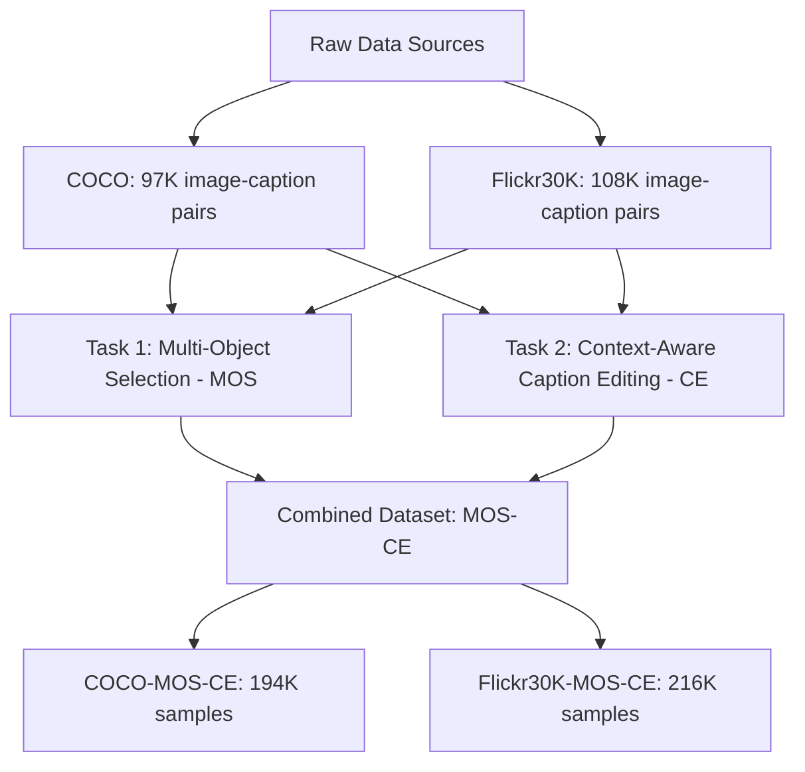
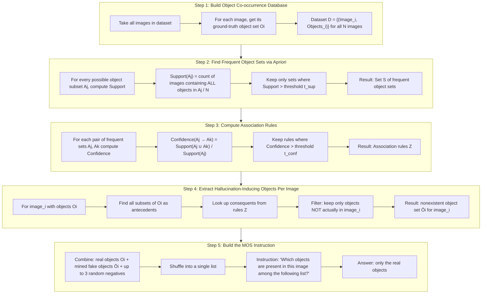
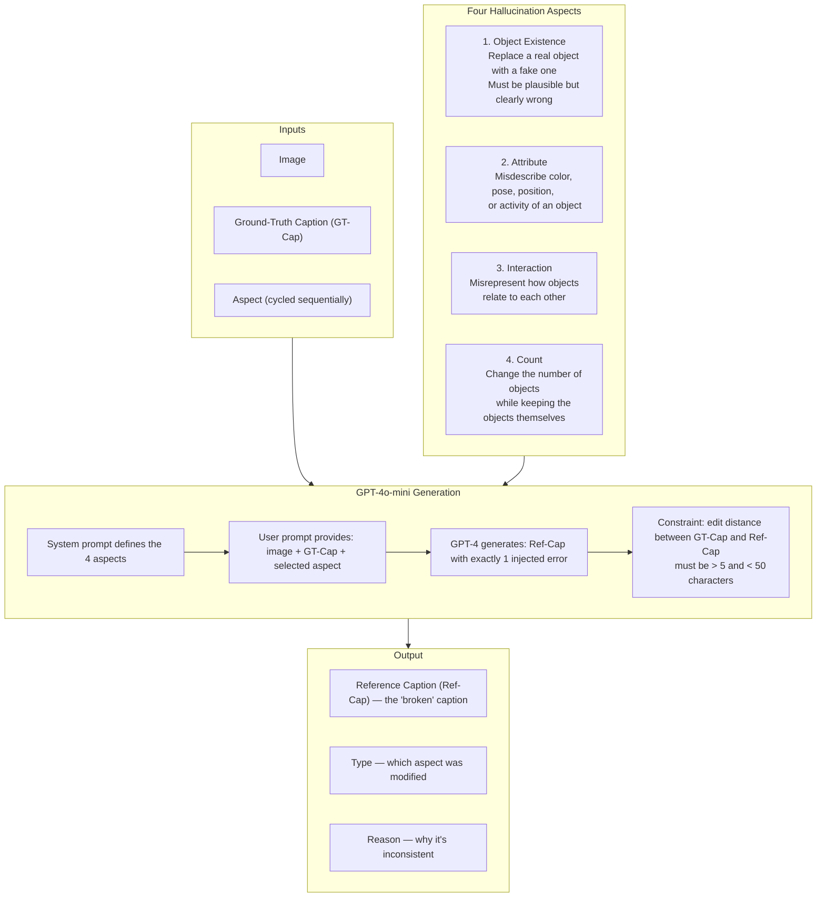
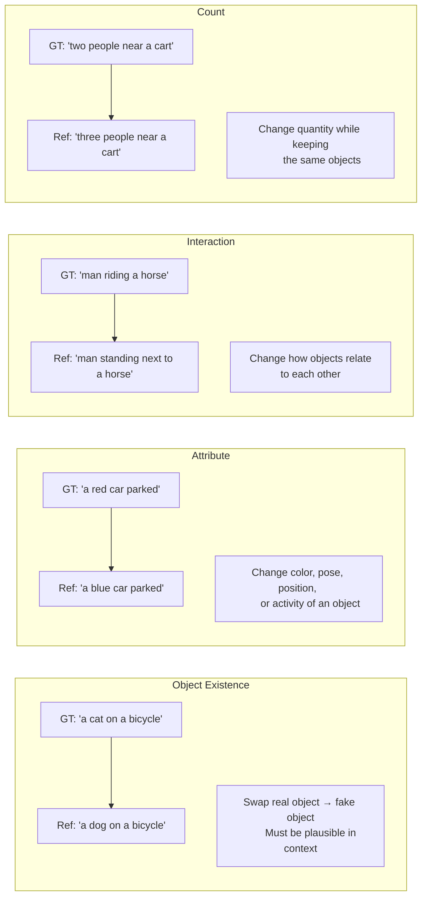
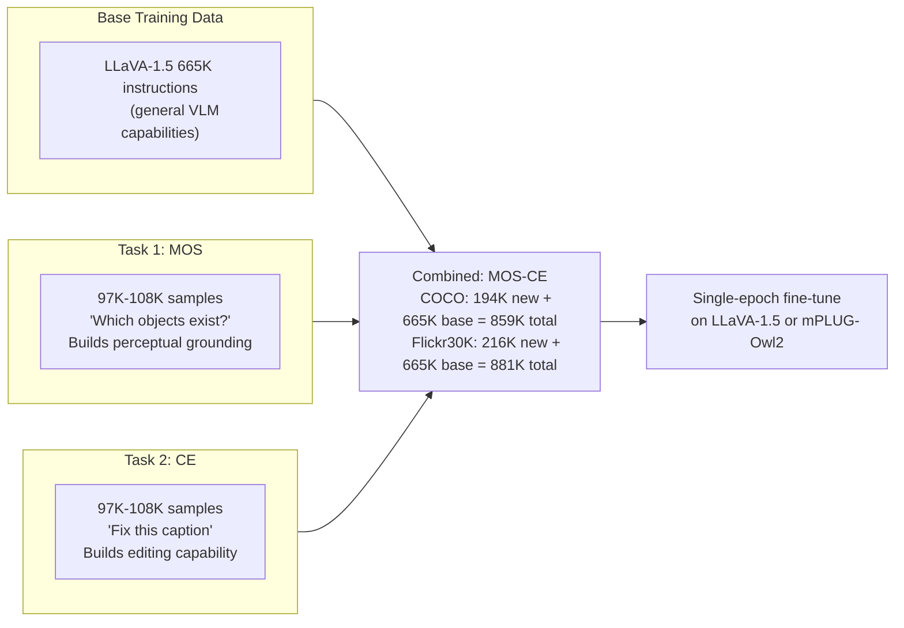
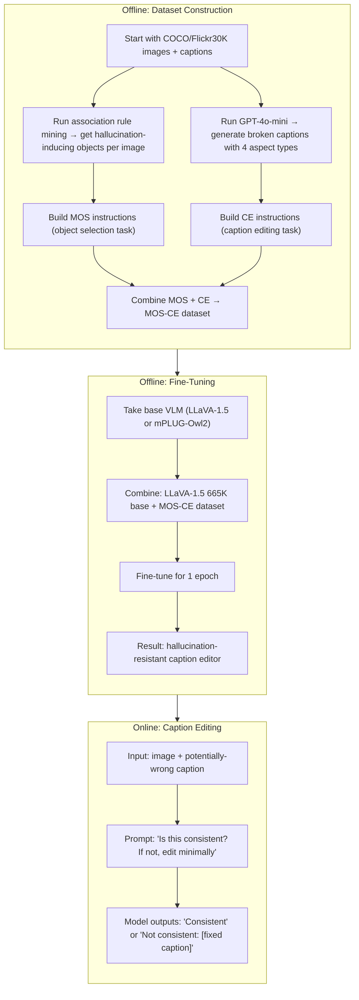
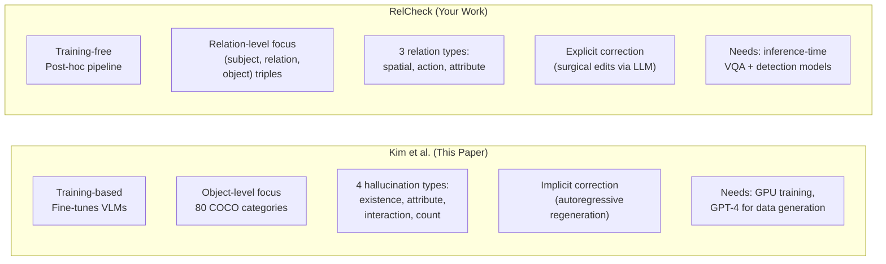

# Deep Analysis: Context-Aware Image Caption Editing via Hallucination-Resistant Visual Instruction Tuning

**Kim, Kang, Song — ETRI — ICCV 2025 Workshop (CLVL)**

---

## What This Paper Is About (Plain English)

You have a caption that describes an image, but the caption has errors — it says things that aren't actually in the image. This paper builds a system that can **detect those errors and fix them**, while keeping the rest of the caption intact.

Their approach: take an existing VLM (like LLaVA-1.5), and **fine-tune it** with a specially crafted instruction dataset that teaches the model two skills:
1. How to tell which objects are really in an image vs. which are fake (hallucination resistance)
2. How to surgically edit a caption to fix only the wrong parts (context-aware editing)

---

## The Models

Two baseline VLMs are used. They do NOT build a new model — they fine-tune existing ones.

| Component | LLaVA-1.5 | mPLUG-Owl2 |
|---|---|---|
| Language backbone | Vicuna-7B | Llama-2-7B |
| Vision backbone | ViT-L/14 | ViT-L/14 |
| Base instruction data | LLaVA-1.5 665K instructions | LLaVA-1.5 665K instructions |
| Training | Single epoch fine-tune | Single epoch fine-tune |

Key point: both models use the **same 665K LLaVA-1.5 instruction set as the base**, then they add their new instruction tasks on top. So "mPLUG-Owl2 + COCO-MOS" means the model was trained on 665K LLaVA instructions + 97K MOS instructions.

---

## The Core Problem They Identified

When you take a vanilla instruction-tuned VLM and ask it to edit a caption, two things go wrong:

1. **Hallucination**: The model generates new incorrect content (invents objects/actions not in the image)
2. **Blind adherence**: The model copies the reference caption too closely, missing actual errors

Their hypothesis: current visual instruction datasets lack tasks that develop **critical and analytical reasoning** — the ability to look at a caption, compare it to the image, and spot what's wrong.

---

## The Two-Task Instruction Dataset

This is the heart of the paper. They create two complementary instruction tasks.



---

## Task 1: Hallucination-Resistant Multi-Object Selection (MOS)

### Goal
Teach the VLM to **accurately perceive which objects exist in an image** — even when presented with plausible-but-fake objects designed to trick it.

### Why This Matters
According to POPE (Li et al., 2023), VLMs hallucinate objects that:
- **Frequently appear** in training data (e.g., "person" shows up everywhere)
- **Frequently co-occur** with objects actually in the image (e.g., if there's a "laptop", the model might hallucinate "mouse" because they often appear together)

### The Association Rule Mining Pipeline

This is the clever part. They don't just pick random fake objects — they specifically mine for objects that would **maximally confuse** the VLM.



### Concrete Example from the Paper

Image: a desk with a computer setup

| Category | Objects |
|---|---|
| Ground-truth (existent) | chair, laptop, mouse, keyboard, book, clock, potted plant |
| Association-rule mined (nonexistent) | person, couch, dining table, vase, cup, remote, cell phone |
| Random negatives added | fire hydrant, handbag, scissors |

The instruction becomes:
```
Q: "Which objects are present in this image among the following list?:
    couch, mouse, fire hydrant, person, handbag, remote, chair, dining
    table, vase, keyboard, cell phone, book, potted plant, scissors, cup,
    clock, laptop"

A: "mouse, chair, keyboard, book, potted plant, clock, laptop"
```

Notice how the fake objects are **not random garbage** — they're things like "person" and "couch" that genuinely co-occur with desk setups in training data. This is what makes them hallucination-inducing.

### Threshold Values

| Domain | t_sup | t_conf |
|---|---|---|
| COCO | 10⁻³ | 10⁻³ |
| Flickr30K | 5 × 10⁻⁴ | 5 × 10⁻⁴ |

### Flickr30K Special Case
Flickr30K doesn't have ground-truth object annotations, so they run **DETR (ResNet-50 backbone)** on the images to extract object lists first.

### Dataset Sizes
- COCO-MOS: 97K samples
- Flickr30K-MOS: 108K samples
- Both use the 80 COCO object categories

---

## Task 2: Context-Aware Image Caption Editing (CE)

### Goal
Teach the VLM to **minimally edit a caption** so it matches the image, while preserving the original sentence structure and context.

### The Hallucination Injection Flow (Reference Caption Generation)

This is where they create the training data — they take correct captions and **deliberately break them** in controlled ways using GPT-4o-mini.



### The Exact GPT-4 Prompt

**System message:**
```
You are a multimodal assistant tasked with modifying captions. 
Specifically, given an image and its corresponding caption, you are 
asked to modify the caption with the following guideline. The modified 
caption must include one aspect that is not consistent with the given 
image. The aspects are as follows:

Object existence: Modify the caption by replacing an existing objects 
with a non-existent one, ensuring that the changes are clearly 
different from the image but remain plausible.

Attribute: Misdescribe the attribute such as color, pose, position, 
and activity of one of the objects in the caption.

Interaction: Modify the caption to mispresent the interactions among 
the objects in the image.

Count: Change the caption to inaccurately represent the number of a 
certain object in the image while still mentioning the actual objects.

The edit distance should be smaller than 50 and greater than 5.
```

**User message:**
```
Based on the given image and caption, modify the caption to be 
inconsistent with the image based upon the given aspect. The output 
format should be as follows:
"image id": 279899
"GT-Cap": image caption before modification
"Ref-Cap": image caption after modification
"Type": type of aspect to generate Ref-Cap: Interaction
"Reason": the reason why the caption is inconsistent with the image

The caption (GT-Cap) is as follows: This is a cat on top of a 
bicycle's basket.
```

### Concrete Example

| Field | Value |
|---|---|
| Image | A cat sitting on a bicycle basket |
| GT-Cap | "This is a cat on top of a bicycle's basket" |
| Ref-Cap (generated) | "This is a cat playing with a dog beside a bicycle" |
| Type | Interaction |
| Reason | "The caption misrepresents the interaction by introducing a dog, which is not present in the image." |

### The Four Hallucination Aspects in Detail



### The Edit Distance Constraint

The edit distance between GT-Cap and Ref-Cap must be:
- **Greater than 5** characters (so the change is meaningful, not trivial)
- **Less than 50** characters (so the original context is preserved, not rewritten)

This is critical — it forces the hallucination to be a **surgical modification**, not a complete rewrite. The model learns to spot and fix small, targeted errors.

### The 50/50 Positive-Negative Split

A subtle but important design choice: **half the training samples have Ref-Cap = GT-Cap** (i.e., the caption is already correct).

Why? This forces the VLM to first **judge whether editing is needed at all**, rather than always assuming the caption is wrong. Previous methods (TIger, DECap) always assume the input caption is incorrect and always try to edit.

### The Instruction Format

```
Q: "Is the following sentence consistent with the image? If not, please 
edit the following sentence to be consistent with the given image, 
making only the minimal necessary changes: [Ref-Cap]
Answer the question in the form '(Consistent or Not consistent): 
+ modified sentence'"

A: "Not consistent: [GT-Cap]"
   — or —
A: "Consistent: [same caption unchanged]"
```

### Dataset Sizes
- COCO-CE: 97K samples
- Flickr30K-CE: 108K samples

---

## How the Two Tasks Combine



The two tasks are **complementary**:
- MOS teaches the model **what's real** (perceptual grounding)
- CE teaches the model **how to fix what's wrong** (editing skill)

The paper shows that MOS alone improves hallucination robustness (POPE scores go up), and CE alone improves editing. But MOS + CE together gives the best results on both metrics — they reinforce each other.

---

## The Complete End-to-End Pipeline



---

## Key Results

### On Their Own CE Benchmark (Table 2)

Best in-domain results (COCO-CE test set):

| Model | BLEU-4 | CIDEr | SPICE |
|---|---|---|---|
| Ref-Caps (do nothing) | 58.2 | 507.6 | 64.7 |
| LLaVA-1.5 baseline | 56.6 | 511.8 | 65.5 |
| LLaVA-1.5 + COCO-MOS-CE | **79.9** | **769.8** | **83.0** |

That's a massive jump — CIDEr goes from 511 to 769.

### On Hallucination Robustness (Table 3, POPE metric)

| Model | COCO Adversarial Acc | AOKVQA Adversarial Acc | GQA Adversarial Acc |
|---|---|---|---|
| LLaVA-1.5 baseline | 85.3 | 88.4 | 91.2 |
| + COCO-EE (prior work) | 85.5 | 87.6 | 90.9 |
| + COCO-MOS | 86.5 | 89.0 | 92.5 |
| + COCO-MOS-CE | **86.8** | **89.6** | **92.6** |

MOS alone helps. MOS + CE helps more. The caption editing task itself improves hallucination resistance — they call this a "complementary relationship."

### On Prior Explicit Editing Benchmarks (Table 1)

| Model | COCO-EE B-4 | COCO-EE CIDEr |
|---|---|---|
| TIger (prior SOTA) | 24.7 | 194.8 |
| DECap | 23.4 | 177.0 |
| LLaVA-1.5 + COCO-EE | **29.0** | **237.6** |
| mPLUG-Owl2 + COCO-EE | 27.9 | 231.0 |

Simply fine-tuning VLMs on the existing editing data already beats prior specialized methods.

---

## Qualitative Examples (What the Models Actually Output)

### Example (a): Interaction error
- **Ref-Cap**: "A man is standing next to a horse in the street."
- **GT-Cap**: "A man is riding a horse in the street."
- **TIger**: "A man is riding a horse." ← loses "in the street"
- **LLaVA-1.5 baseline**: "A man is standing next to a horse in the street." ← no change, blind adherence
- **LLaVA-1.5 + EE**: "A man is riding a horse." ← loses context
- **LLaVA-1.5 + MOS-CE (theirs)**: "A man is riding a horse in the street." ← perfect, minimal edit

### Example (b): Count error
- **Ref-Cap**: "Three people dressed differently are standing near a cart and looking at vegetables."
- **GT-Cap**: "Two people..."
- **mPLUG-Owl2 baseline**: Changes "vegetables" to "fruits" ← hallucinates a different fix
- **LLaVA-1.5 + MOS-CE**: "Two people dressed differently are standing near a cart and looking at vegetables." ← correct, only changes "three" to "two"

---

## Comparison to RelCheck



| Dimension | Kim et al. | RelCheck |
|---|---|---|
| Approach | Fine-tune VLM with instruction data | Training-free post-hoc pipeline |
| Hallucination granularity | Object-level (which objects exist?) | Relation-level (how do objects relate?) |
| Error taxonomy | Existence, Attribute, Interaction, Count | Spatial, Action, Attribute |
| Correction method | Autoregressive caption regeneration | Targeted LLM-based surgical edits |
| Context preservation | Via edit distance constraint in training data | Via "minimal correction" prompt to Llama |
| Hallucination detection | Learned implicitly through MOS task | Explicit VQA probes + spatial verification |
| Models needed | 1 fine-tuned VLM | BLIP-2 + OWLv2 + LLaVA + Llama (ensemble) |
| Training cost | 1 epoch fine-tune (~hours on GPU) | Zero training |
| Their "interaction" ≈ your | Relation-level hallucination | Core focus of RelCheck |

The biggest overlap: their "interaction" hallucination type is essentially what RelCheck targets as relational hallucinations. But they treat it as one of four categories, while you make it the entire focus with structured triple extraction and verification.
